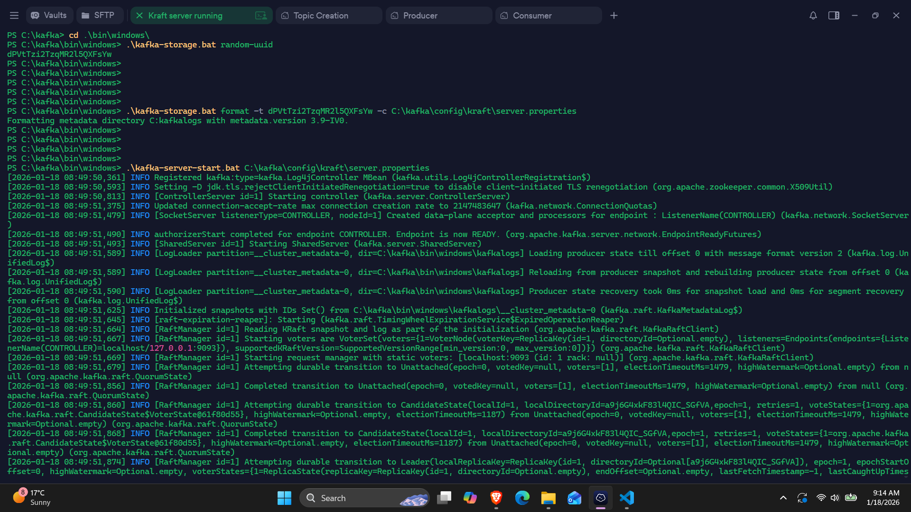

# Apache-Kafka-learning

### Install Kafka version -> 3.9.1

### First Steps: 

1. Run the Kraft server:
     ```
         .\kafka-storage.bat random-uui -> Get UUID
         .\kafka-storage.bat format -t <Paste the UUID> -c C:\kafka\config\kraft\server.properties -> This will update you kraft server config files
         .\kafka-server-start.bat C:\kafka\config\kraft\server.properties -> This will start the kafka server in local at localhost:9092
     ```
     <details>
<summary>Click to see the image</summary>



</details>


     
3. Run the Topic Creation, Describe, etc cmds:
     ```
          PS C:\kafka\bin\windows> .\kafka-topics.bat --create --topic test-topic-1 --bootstrap-server localhost:9092 --partitions 2 --replication-factor 1
          Created topic test-topic-1.

          PS C:\kafka\bin\windows> .\kafka-topics.bat --list --bootstrap-server localhost:9092
          test-topic-1

          PS C:\kafka\bin\windows> .\kafka-topics.bat --describe --topic test-topic-1 --bootstrap-server localhost:9092
          Topic: test-topic-1     TopicId: tiWhGIJuTBysNQYCb88kQg PartitionCount: 2       ReplicationFactor: 1    Configs: segment.bytes=1073741824
                  Topic: test-topic-1     Partition: 0    Leader: 1       Replicas: 1     Isr: 1  Elr:    LastKnownElr:
                  Topic: test-topic-1     Partition: 1    Leader: 1       Replicas: 1     Isr: 1  Elr:    LastKnownElr:
          PS C:\kafka\bin\windows>

          PS C:\kafka\bin\windows> .\kafka-topics.bat --version
          3.9.1
     ```
5. Run the producer:
     ```
          PS C:\kafka\bin\windows> .\kafka-console-producer.bat --topic test-topic-1 --bootstrap-server localhost:9092
          >
          >first message from kafka producer - satyarth tiwari
          >
          >hello world , i am learing kafka
     ```
7. Run the consumer:
   ```
        PS C:\kafka\bin\windows> .\kafka-console-consumer.bat --topic test-topic-1 --bootstrap-server localhost:9092
        first message from kafka producer - satyarth tiwari

          hello world , i am learing kafka
   ```


